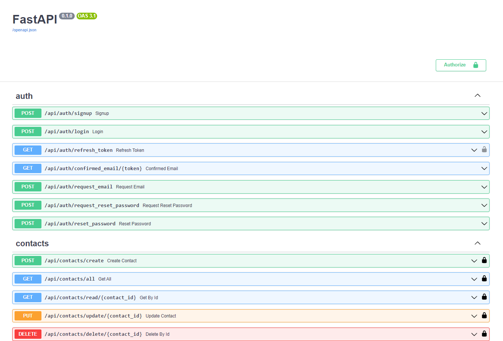
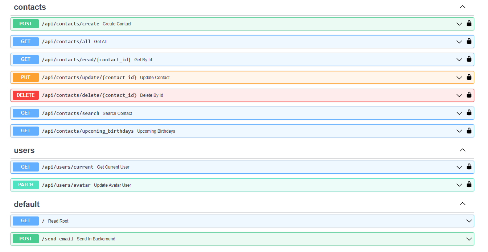

# web13hm

## Executing

- > git clone https://github.com/3xecut0r/web13hm.git

- > cd web13hm

- ### You should create ".env" in root directory with credentials

- > poetry shell

- ### Run Docker first

- > docker-compose up -d

- > "python3 main.py" or "uvicorn main:app --reload"

